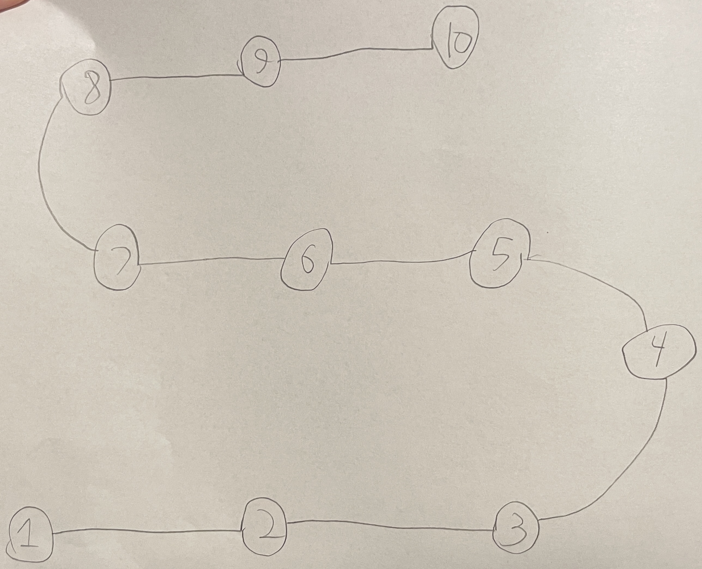

# Large Level Map

When you complete or pause a level, there is a button on the right that looks
like four little squares making a bigger square. Pressing that button should
take you to a screen that looks like this hand sketch:

So this is all the levels 1–10 joined by curvy lines. Very similar to the other
level maps, which have only five levels each.

Levels that you haven't yet reached are 'locked', and have a graphical padlock
on them to indicate as such. They should not be clickable.

Levels that you have reached are drawn with their number and no padlock. When
the user taps the button, it starts the game on that level. When you do this,
your maximum level that you've reached **should not change**. So now we have a
concept of 'current level' and 'max level unlocked', whereas before we only had
the one.
