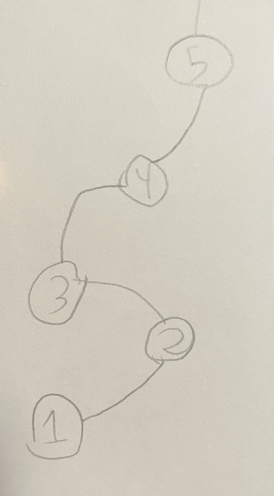
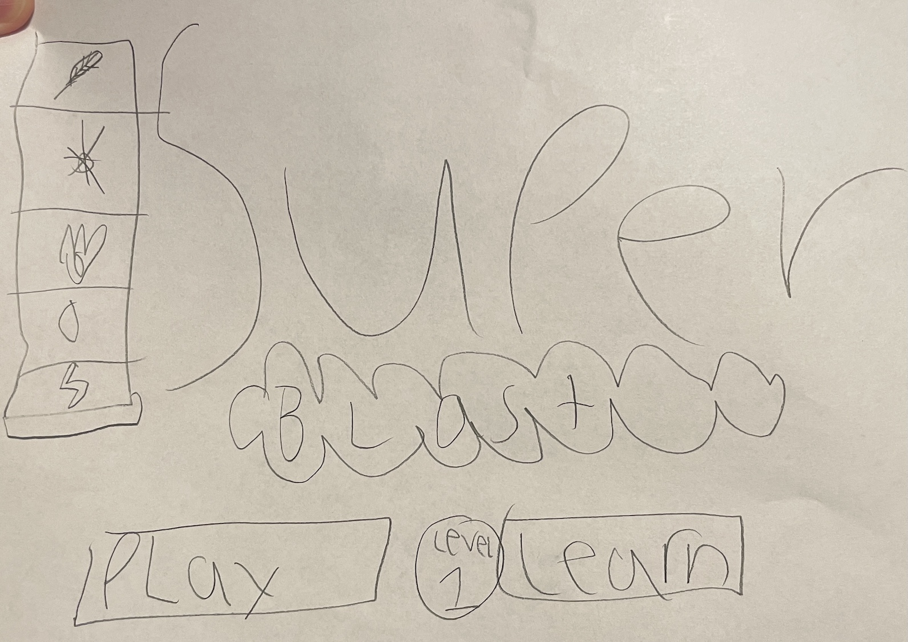

# Superblast!

## Development Process

I want to focus on showing interactive graphics at all points.

## Overview

This is a web browser based game. It is single player.

It shows one screen at a time. There is no scrolling.

The main game board shows a 9x7 (9 wide, 7 high) grid of squares. The board
should take the full height and width of the screen.

Each square can hold one of five symbols:

- Leaf (green)
- Snowflake (light blue)
- Fire (red)
- Raindrop (dark blue)
- Lightning (yellow)

The initial configuration for the game is to randomly assign a symbol to each
cell on the board, subject to the constraint that a symbol can not be a neighbor
to the same symbol.

The player is able to pick a cell and a neighboring cell and swap their symbols.
This is done by sliding the mouse from one cell into an adjacent cell. If by
doing this the board now has three or more of the same symbol in a row, the
symbols in those cells disappear and the player is awarded points:

- 10 points for 3 in a row
- 20 points for 4 in a row
- 30 points for 5 in a row

## Power Ups

There are three power-ups:

1. Free swap: drag this to any cell, and it turns green. Then you can slide that
   green cell into any cell on the board and they will swap, even if they don't
   form a match. To get free swap, make a match of four. You can have an
   unlimited number of free swaps.

2. Clear cells: Drag it to any cell, and that cell and all its neighbors
   (including diagonals) will disappear. By itself this does not award any
   points or power but the symbols that are generated to replace the disappeared
   symbols _can_ form a match. This is useful for clearing a problem area. To
   earn this, complete a level: if there is more than one minute left on the
   clock, you get two; otherwise just one. You can have an unlimited number of
   Clear Cells power-ups.

3. Symbol Swap: Drag it to any cell, and all the cells on the board with that
   symbol are randomly replaced with any symbol at all (including the symbol
   type that was originally there). There are two ways to get a symbol swap: (a)
   get a match of five, or (b) cause a chain reaction of matches on a single
   move. You can have an unlimited number of Symbol Swap power-ups.

   A free swap power-up looks like a circle with two triangles pointing towards
   each other on the circle. The two triangles are constantly rotating around
   the circle. The circle is white and the triangles are green.

   A Clear Cells power-up looks like a yellow five-pointed star.

   A Symbol Swap power-up looks like a rectangle with a triangle on top and
   another on the bottom, with three circles inside the rectangle. Rectangle is
   purple, the triangles are white, and the circle is yellow.

## Level Map

The level map is the last item in the panel on the right side of the screen. It looks different depending on what level
you are on.

Levels 1 to 5: it looks like .

Levels 6 to 10 it looks like .

## Home Screen

The Home Screen looks like this:

At left are the five symbols, just as a sort of branding op. Shows the cast of
characters.

Middle is Super Blast with the "super" written large and the "blast" written
inside a cloud shape.

Below that are two buttons: Play and Learn, and between them is Level X, where X
is the highest level you've unlocked so far.

The Play button will take you to the level menu.

## Level Symbol Probability

Currently, when a match is made, the game will choose new symbols to reappear in
the cleared cells. They currently have equal probability.

### Levels 1 to 5

We are going to update levels 1 through 5 to use non-uniform probability. Each
level will have one 'privileged' symbol that has a higher probability of
appearing than the other symbols.

- Level 1: Leaf
- Level 2: Snowflake
- Level 3: Flame
- Level 4: Raindrop
- Level 5: Lightning Bolt

The privileged symbol has a 40% chance of appearing. Make this a tunable
parameter.

There is one exception to this rule. If a match is for cells with the privileged
symbol, then the probability is uniform (do not use the privileged probability
distribution).

### Levels 6 to 8

When you receive power-ups, there is a chance that you will receive two of the
same power-up. Each level promotes a different power-up:

- Level 6: Free Swap
- Level 7: Clear Cells
- Level 8: Symbol Swap

The probability of getting a double is 30%. Make this a tunable parameter.

### Levels 9 and 10

These levels don't have any special probability bonuses.
